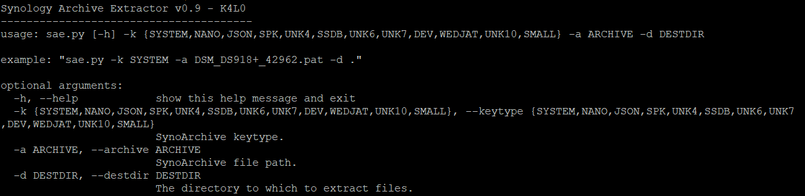

# Synology_Archive_Extractor

usage:

Supports all synoarchive types.

Run it on your own nas, with root privilege.

On x86 linux, the required libraries are located in /usr/lib:

  libcrypto.so.1.1   
  libicudata.so.64  
  libicui18n.so.64    
  libicuuc.so.64   
  libmsgpackc.so.2  
  libsodium.so  
  libsynocodesign.so   
  libsynocore.so.7   
  libsynocredentials.so.7   
  libsynocrypto.so.7 
